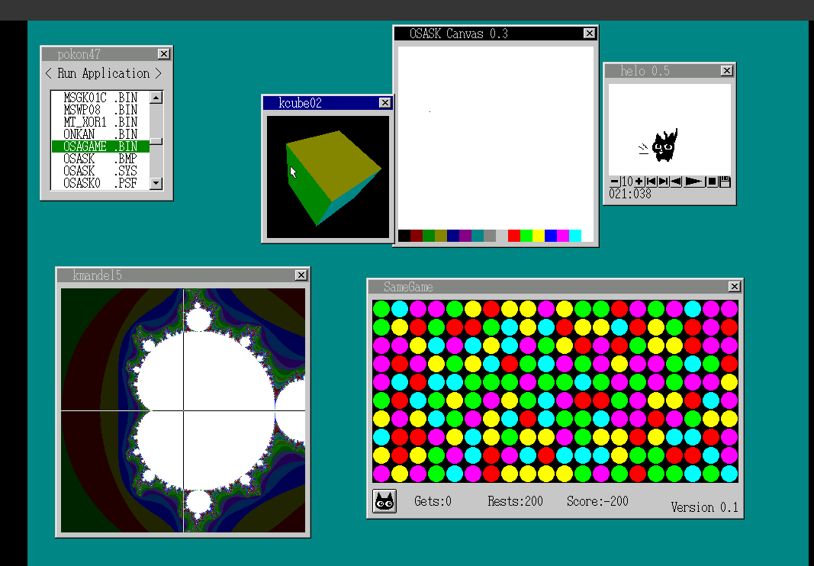
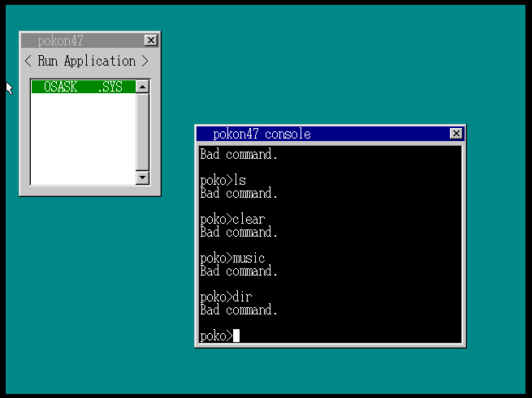
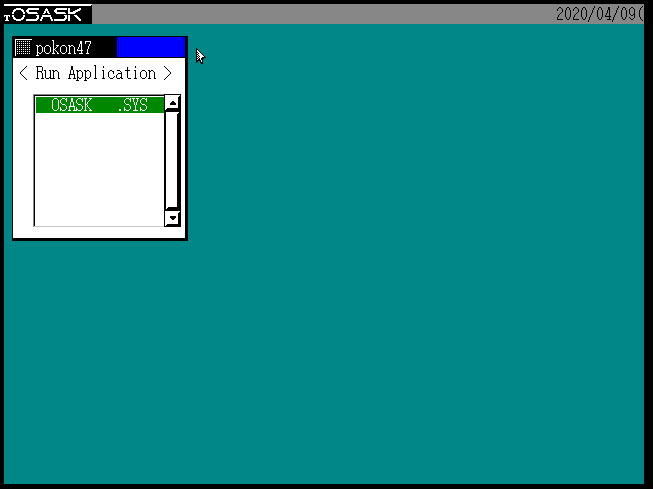
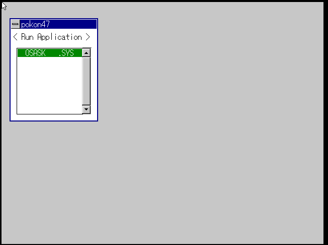
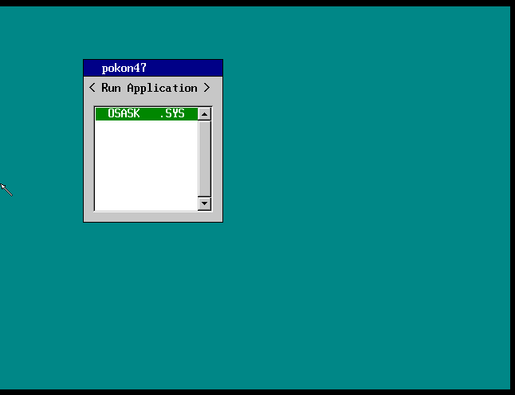
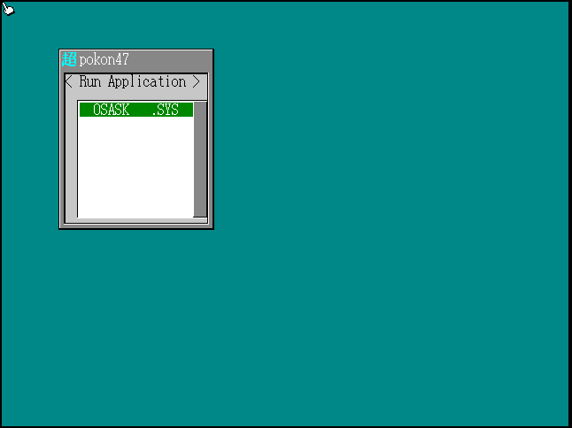

= ソースコードからOSASKをビルドして起動させる (2020年版) =

このページでは、OSASK をソースコードからビルドする方法を説明します。(アプリはバイナリです)
2020年時点でコンパイルするためには、一部ソースコードの書き換えが必要でしたので、それを含めて記します。

.動作させたデモ
video::osask2020_demo.mp4[width=480]

.手元環境は以下の通りです。
* Arch Linux 64bit
* gcc 9.3.0
* clang 9.0.1

== Step 1: はりぼてOS向けtolset の用意 ==

hikalium さんなどによりメンテナンスがなされているはりぼてOS向けtolset https://github.com/HariboteOS/z_tools_linux[z_tools_linux] を取得し、 `z_tools` にコピーします。

== Step 2: Asuka をビルド ==
OSDN のダウンロードページ https://ja.osdn.net/projects/osask/releases/ から
`Asuka_src_1.1.tar.gz` footnote:[派生版は原則名称を変更することになっており、これは hideyosi さんによる ASKA の派生物です。] をダウンロードします。
伸張すると `Asuka_src_1.1/` なるディレクトリが生成されているはずです。

そして次のパッチ link:osask2020_Asuka.diff[osask2020_Asuka.diff] を `patch -p0 < osask2020_Asuka.diff` として当てます。このパッチでは `strcmp()` などの関数を明示的に宣言した上で `Makefile` を書き換えます。(この差分は KL-01 に従います。)

////
[source,diff]
----
include::osask2020_Asuka.diff[]
----
////

`make` コマンドでビルドすると、 `aska` が生成されているはずです。
生成物は `z_tools/aska` としてコピーします。

== Step 3: tolset の不足ライブラリを埋める ==

Step 1 で取得したライブラリは「はりぼてOS」をコンパイルすることに最適化されており、OSASK をコンパイルするには一部不足しているライブラリがあります。そこで、
28GO footnote:[GO言語ではなく、gcc から派生したC言語のコンパイラ。] から必要なライブラリを取得してきます。

まずは、 `28GO_K_0033` および `28GO_K_0031` をOSDN のページからダウンロードして伸張します。

=== guigui00 ===
`mkdir z_tools/guigui00` としてその中に
`28GO_K_0033` の `go_lib/go_lib.h` `guigui00.h` `include/stddef.h` `guigui00/stdlib.h` を複製します。

その後、`z_tools/guigui00/stdlib.h` に次のパッチ link:osask2020_stdlib.diff[osask2020_stdlib.diff] (KL-01 に従います) を当てます。


=== gg00libc ===
`28GO_K_0033/gg00libc/` に次のパッチ link:osask2020_gg00libc.diff[osask2020_gg00libc.diff] (KL_01 に従います) を当てます。

`pushd 28GO_K_0033/gg00libc/` として `make` すると `28GO_K_0033/gg00libc/gg00libc.lib` が生成されます。

最後に、`28GO_K_0033/gg00libc/gg00libc.lib` を `z_tools/guigui00/gg00libc.lib` にコピーします。


////
`go_lib/GO_lib.h` に `include/go_lib.h` からシムリンクを貼ります。
`go_lib/` に次のパッチ link:osask2020_go_lib.diff[osask2020_go_lib.diff] を当てます。
////
////
`make go_lib/` でビルドします。
不要？
////

=== golibc ===

`28GO_K_0031` 以下に次の
link:osask2020_28go0031.diff[osask2020_28go0031.diff] を当てます。Makefile 変更や不必要な定義の削除があります。(KL-01 に従います。)

その後、 `pushd 28GO_K_0031` としたのち
`make golibc` とビルドします。
出来上がった `28GO_K_0031/golibc/golibc.lib` を `z_tools/guigui00/golibc.lib` にコピーします。

== Step 4: osalink をビルド ==

OSDN のダウンロードページ 28GO 0031 から `osalink1_src_1.0.tar.gz` をダウンロードします。

link:osask2020_osalink1.diff[osask2020_osalink1.diff] を当てます。ファイル名の大文字小文字の違いに従います (KL-01 に従います。)

これは素直に `pushd osalink1_src_1.0` にて移り `clang osalink1.c -o osalink1` にてビルドできます。

生成物は `z_tools/osalink1` としてコピーします。

== Step 5: OSASK のビルド ==

OSASK 本体のソースコードは http://osask.net/d/download/index2.html[OSASK のイージーダウンロード] ページからダウンロードし伸張します。
そして次のパッチ
link:osask2020_osask.diff[osask2020_osask.diff] を当てます。Makefile 変更や不必要な定義の削除があります。(KL-01 に従います。)

////
[source,diff]
----
include::osask2020_osask.diff[]
----
////

当てたあとは `make img_at` でビルドします。すると `4.7/` 以下に `OSAIMGAT.BIN` が生成されているはずです。

== Step 6: OSASK の実行 ==

`qemu-system-i386 -fda 4.7/OSAIMGAT.BIN` にて実行できます。

この時点ではまだ解像度が不十分ですが、後ほど `OSASK0.PSF` を導入すると高解像度で動作します。

== Step 7: アプリを入れる ==
http://hrb.osask.jp/wiki/?tools%2Fedimg[edimg] を使うとできます。
現状では OSASK 4.7 アプリのソースコード配布箇所を見つけられておらず、既存バイナリから取り出す方法を説明します。

まず先に紹介したイージーダウンロードページから、AT互換機用お勧めパックを取得し伸張します。このファイルからアプリのバイナリを取り出します。
`apps/` 以下に OSASK 4.7 バイナリ `edimg` イメージファイルからアプリケーションを取り出します。
....
$ ../z_tools/edimg imgin:./osat47i/OSAIMGAT.BIN copyall from:@: to:./4.7/apps/```
....

次に、edimg でアプリを書込みます。 `apps.txt` に次の link:osask2020_apps.txt[apps.txt] を書きます。
これは edimg のコマンドを羅列したものになります。

////
....
include::osask2020_apps.txt[]
....
////

と edimg スクリプトを書き
....
$ pushd 4.7 && ../z_tools/edimg @apps.txt
....
としてファイル `4.7/OSAAPPS.BIN` を作成します。

`qemu-system-i386 -fda 4.7/OSAAPPS.BIN` にて実行できます。

.アプリケーションを入れたところ


== おまけ: OSASK のカスタマイズ ==

`4.7/make_inc.txt` の `DESIGN` や `FONTSRC` を書き換えて見た目の違うOSASK をビルドできます。

.WIN95 風モードにしたところ


.TOWNS 風モードにしたところ


.Windows 3.1 風モードにしたところ


.NEWSTYLE  風モードにしたところ


.超漢字風モードにしたところ


== 課題 ==
- アプリケーションのソースコード配布箇所を発見できていません。
- teditc および WABA, picture0 が動作せず、例外となります。
